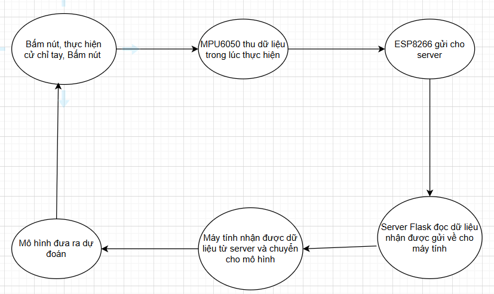
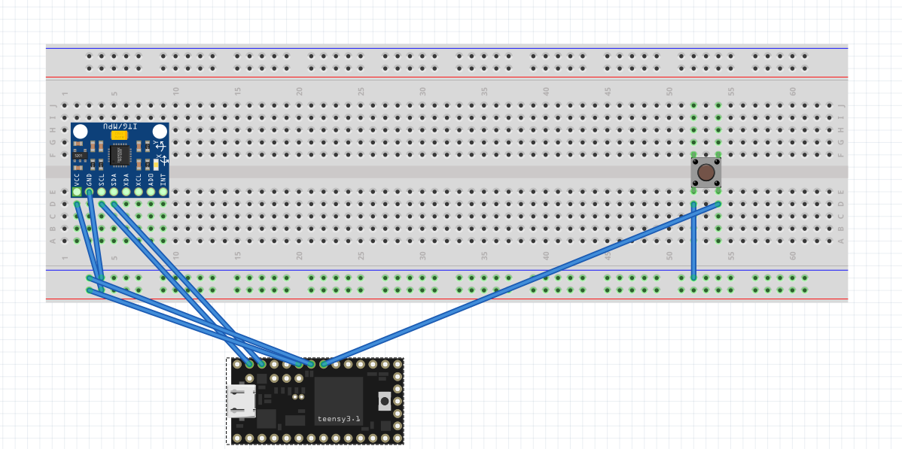
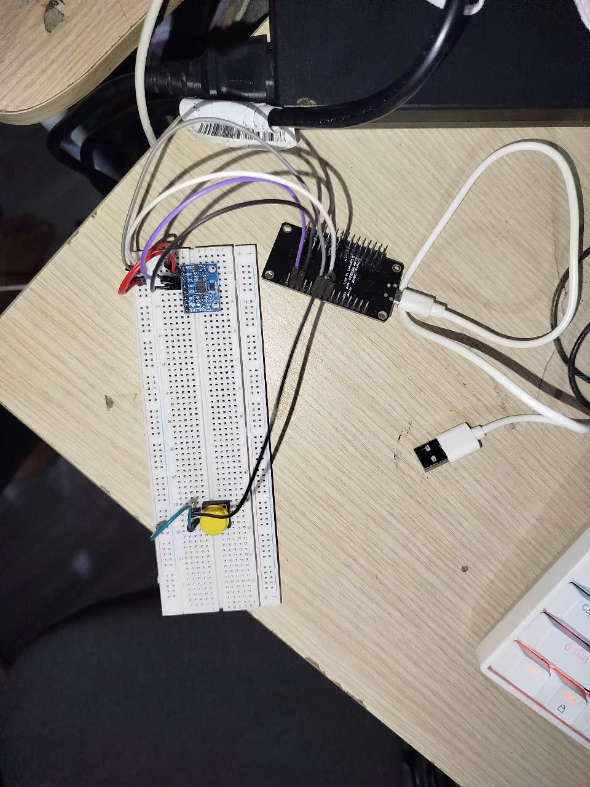
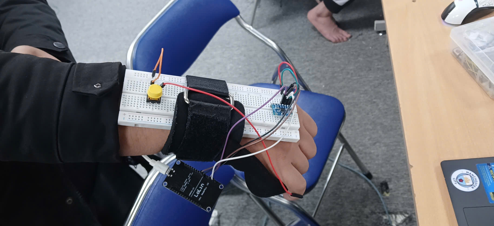
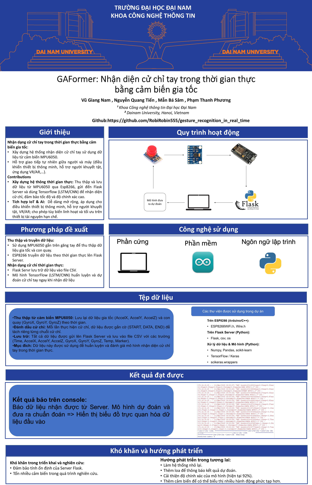

<h1 align="center">Nhận dạng cử chỉ tay trong thời gian thực

 </h1>

  
  

<h2 align="center">Nhận dạng cử chỉ tay bằng MPU6050 và ESP8266 trong thời gian thực</h2>

## 🌟 Giới thiệu

 Dự án này sử dụng ESP8266 và cảm biến MPU6050 để nhận dạng cử chỉ tay trong thời gian thực. Dữ liệu cảm biến được gửi đến server Flask, xử lý bằng mô hình LSTM để phân loại các cử chỉ. Kết quả dự đoán sẽ được hiển thị trực tiếp và trực quan hóa bằng biểu đồ dữ liệu.

🚀 Chức năng chính

---
- **📡 Truyền dữ liệu qua WiFi: ESP8266 gửi dữ liệu từ MPU6050 đến server Flask.**
- **🤖 Nhận dạng cử chỉ bằng AI: Mô hình LSTM xử lý dữ liệu và phân loại cử chỉ.**
- **📊 Hiển thị trực quan: Biểu đồ dữ liệu cảm biến được hiển thị ngay sau khi dự đoán.**
- **⚡ Thời gian thực: Hệ thống đưa ra dự đoán ngay sau khi cử chỉ được thực hiện.**

---
## 📚 Hệ thống

## 📂 Cấu trúc dự án

📦 Project  
├── 📂 test_thu_thap1  # Thư mục chứa mã nguồn Esp8266 để thu thập dữ liệu cảm biến làm databasedatabase

├── 📂 code_test_dudoan_esp8266  # Thư mục chứa mã nguồn Esp8266 để thu thập dữ liệu cảm biến làm dữ liệu dự đoánđoán  

├── server1.py # Mã nguồn server Flask để nhận dữ liệu từ Esp8266 và lưu vào database(gesture_data)  

├── test_du_doan_voi_server_2.py # Mã nguồn server Flask để nhận dữ liệu từ Esp8266 để mô hình dự đoán trong thời gian thực

├── gesture_data.csv  # Cơ sở dữ liệu 

├── gesture_model.keras  # Mô hình đã được huấn luyện để dự đoán cử chỉ tay

├── test_model_3.py # Mã nguồn để huấn luyện mô hình LSTM(Tensorflow) và dự đoán cử chỉ tay

├── 📂images  # Thư mục chứa ảnh

├── 📂docs  # Thư mục chứa pptx thuyết trình và Latex

---

## 🛠️ CÔNG NGHỆ SỬ DỤNG

### 📡 Phần cứng

### 🖥️ Phần mềm

## 🛠️ Yêu cầu hệ thống

### 🔌 Phần cứng
- **ESP8266**: Vi điều khiển kết nối WiFi.

- **MPU6050**: Cảm biến gia tốc và con quay hồi chuyển.

- **Nút nhấn**: Bắt đầu/kết thúc thu thập dữ liệu.

### 💻 Phần mềm
- **🐍 Python 3+**
- **⚡ Arduino IDE** :để nạp code lên board ESP8266.

### 📦 Các thư viện Python cần thiết
Cài đặt các thư viện bằng lệnh:

    pip install flask numpy tensorflow matplotlib
## 🧮 Bảng mạch

### 🔩 Kết nối phần cứng:

## Sau khi lắp xong

## Gắn lên tay

### ⛓️‍💥 Hướng dẫn cắm dây
| Thiết bị        | Chân trên thiết bị | Kết nối Arduino UNO | Ghi chú                         |
|-----------------|-------------------|---------------------|---------------------------------|
| Breadboard      |    (+),(-)       |      (+) → 3.3V,(-) → GND         | Dùng để kết nối linh kiện       |
| MPU6050    | GND,VCC,SDA,SCL | GND → (-), VCC → (+), SDA → D2, SCL → D1 | Kết nối MPU6050 với ESP8266|
| NNút bấm     | (+),(-) | (+) → D5,(-) → GND | út bấm để bắt đầu và kết thúc thu dữ liệu|
| ESP8266        | GND,3.3V,D1,D2,D5            |  3.3V → (+) ,GND → (-),D1 → SCL, D2 → SDA, D5 → (+)(nút bấm)|Điều khiển và kết nối Wifi|
| 8 dây điện      | -                 | -                   | Dùng để nối các linh kiện       |

## 🚀 Hướng dẫn cài đặt và chạy
1️⃣ Chuẩn bị phần cứng
- **Nạp mã Arduino**:

    1. Mở file trong folder "code_test_dudoan_esp8266 " bằng Arduino IDE.
    2. Kết nối board ESP8266 với máy tính.
    3. Đảm bảo ESP8266 xuất hiện trên cổng COM5 .
    4. Kiểm tra và điều chỉnh ssid, password và serverHost sao cho phù hợp với mạng WiFi và server của bạn.
    5. Nạp mã vào ESP8266 .
    

2️⃣ Cài đặt thư viện Python. 

Cài đặt Python 3 nếu chưa có, sau đó cài đặt các thư viện cần thiết bằng pip.

4️⃣ Chạy các chương trình

Để đảm bảo hệ thống hoạt động đúng cách, bạn cần khởi chạy `test_du_doan_voi_server_2.py` trước. Sau khi thấy console thông báo đã mỡ server thành công thì mới cấp nguồn cho ESP8266 và mở Serial Monitor với baus là 11500 để xem Esp đã thông báo kết nối wifi thành công và khởi động MPU6050 chưa. Sau khi đã đạt đủ điều kiện mới tới bước tiếp theo

✅ Chạy ứng dụng chính (`test_du_doan_voi_server_2.py`):

    python test_du_doan_voi_server_2.py
- Ứng dụng sẽ:

    - Khởi tạo server Flask và mô hình đã được lưu từ trước rồi chờ nhận dữ liệu từ ESP8266.

## 📖 Hướng dẫn sử dụng
1️⃣ Bắt đầu thực hiện

- Người dùng bấm nút để bắt đầu thực hiện hành động.
- Trong khi người dùng thực hiện hành động thì ESP8266 sẽ liên tục gửi dữ liệu từ MPU6050 tới server Flask (có thể quan sát trong serial monitor).
- Trên console, server flask sẽ liên tục trả về dữ liệu nhận được từ ESP8266. 

    
2️⃣ Bắt đầu dự đoán
- Khi người dùng bấm nút lần nữa sau khi thực hiện xong cử động thì server sẽ bắt đầu gửi dữ liệu nhận được từ ESP8266 tới mô hình đã được lưu trước đó để tiến hành dự đoán.
- Trước khi dự đoán, ta sẽ thấy 1 biểu đồ trực quan hóa dữ liệu nhận đưọc từ ESP8266. Sau đó, mô hình đã được lưu trước đó sẽ tiến hành dự đoán và xuất ra console kết quả dự đoán.

3️⃣ Lặp lại
- Sau khi mô hình đưa ra dự đoán thì người dùng có thể bấm nút để thực hiện hành động khác và lặp lại các bước trên.

## ⚙️ Cấu hình & Ghi chú

1. ESP8266: 
- Với mỗi mô trường khác nhau, ta phải cấu hình lại các chỉ số ssid, password và serverHost cho phù hợp.
2. Server Flask:
- Hãy nhớ cho server Flask chạy mọi lúc trong lúc thực hiện để có thể nhận dữ liệu từ ESP8266 liên tục.
3. Khi thực hiện: 
- Hãy đảm bảo ESP8266 được cấp nguồn liên tục trong quá trình thực hiện để có thể gửi dữ liệu liên tục tới server Flask.
- Hãy gắn bread broad lên tay như hình để có thể dễ dàng thực hiện hành động và quan sát kết quả.

## 📰 Poster

  

## 🤝 Đóng góp
Dự án được phát triển bởi 4 thành viên:

| Họ và Tên       | Vai trò                  |
|-----------------|--------------------------|
| Vũ Giang Nam | Biên soạn tài liệu Overleaf, Phát triển toàn bộ mã nguồn, thiết kế cơ đồ lắp đặt, kiểm thử, triển khai dự án, thuyết trình .|
| Mẫn Bá Sâm | Biên soạn tài liệu Overleaf, hỗ trợ bài tập lớn.|
| Nguyễn Quang Tiến    |  Thiết kế slide PowerPoint, poster, hỗ trợ bài tập lớn.  |
| Phạm Thanh Phương     | Hỗ trợ bài tập lớn, triển khai video       |

© 2025 NHÓM 2, CNTT16-03, TRƯỜNG ĐẠI HỌC ĐẠI NAM